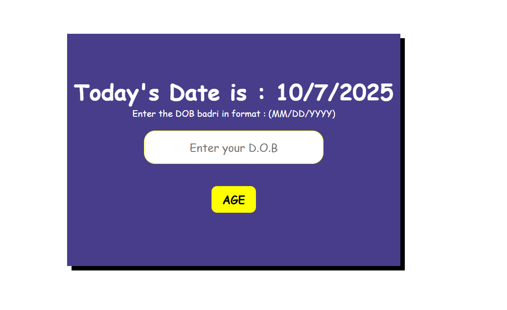

# Age Calculator

A simple web-based age calculator that allows users to calculate their age based on their date of birth.

## Features

- Displays current date
- User-friendly interface with date input
- Calculates age in years
- Responsive design with attractive styling


## Preview 



## Technologies Used

- HTML5
- CSS3
- JavaScript (ES6)

## Project Structure

```
Age-Calculator/
├── index.html      # Main HTML file
├── style.css       # Stylesheet for UI design
├── script.js       # JavaScript functionality
└── README.md       # Project documentation
```

## Setup and Installation

1. Clone or download the project files
2. Open `index.html` in any modern web browser
3. No additional setup or dependencies required

## Usage

1. Open the application in your web browser
2. The current date will be displayed automatically
3. Enter your date of birth in MM/DD/YYYY format
4. Click the "AGE" button to calculate your age
5. Your age will be displayed in the result area

## Input Format

- Date format: MM/DD/YYYY (e.g., 12/25/1990)
- Use forward slashes (/) as separators

## Browser Compatibility

This application works on all modern web browsers including:
- Chrome
- Firefox
- Safari
- Edge


## Contributing

Feel free to fork this project and submit pull requests for improvements or bug fixes.

## License

This project is open source and available under the MIT License.