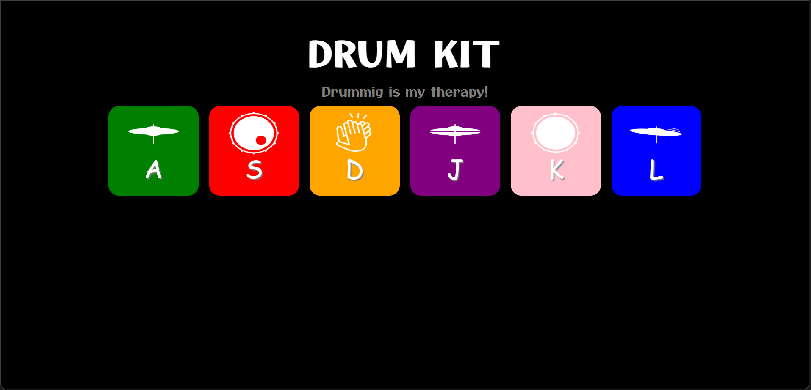

# 🥁 Drum Kit

A web-based interactive drum kit that allows users to play drum sounds using keyboard keys or mouse clicks. Perfect for music enthusiasts and anyone looking to have some fun with virtual drumming!

## ✨ Features

- **Interactive Drum Pads**: Click on drum pads to play sounds
- **Keyboard Support**: Play drums using keyboard keys (A, S, D, J, K, L)
- **Visual Feedback**: Drum pads light up and scale when pressed
- **Responsive Design**: Works on desktop, tablet, and mobile devices
- **6 Different Drum Sounds**: Various drum kit sounds including hi-hat, snare, kick, etc.

## Preview



## 🎮 How to Play

### Mouse Controls
- Click on any drum pad to play the corresponding sound

### Keyboard Controls
- **A**: Closed Hi-Hat
- **S**: Snare (pad 2)
- **D**: Kick (pad 3)
- **J**: Crash (pad 4)
- **K**: Open Hi-Hat (pad 5)
- **L**: Clap (pad 6)

## 🚀 Getting Started

1. Clone or download this repository
2. Open `index.html` in your web browser
3. Start drumming!

No installation or setup required - just open and play!

## 📁 Project Structure

```
Drum/
├── index.html          # Main HTML file
├── style.css           # Styling and responsive design
├── app.js              # JavaScript functionality
├── images/             # Drum kit images
│   ├── closed-hihat.png
│   ├── snare.png
│   ├── kick.png
│   ├── crash.png
│   ├── open-hihat.png
│   └── clap.png
└── sounds/             # Audio files
    ├── sound1.mp3
    ├── sound2.mp3
    ├── sound3.mp3
    ├── sound4.mp3
    ├── sound5.mp3
    └── sound6.mp3
```

## 🛠️ Technologies Used

- **HTML5**: Structure and audio elements
- **CSS3**: Styling, animations, and responsive design
- **JavaScript**: Interactive functionality and event handling
- **Google Fonts**: Otomanopee One font family


## 🎨 Customization

You can easily customize the drum kit by:
- Replacing audio files in the `sounds/` folder
- Updating drum pad images in the `images/` folder
- Modifying colors and styles in `style.css`
- Adding more drum pads by extending the HTML and JavaScript

## 🤝 Contributing

Feel free to fork this project and submit pull requests for any improvements!


**"Drumming is my therapy!"** 🎵

Enjoy making music with your virtual drum kit!