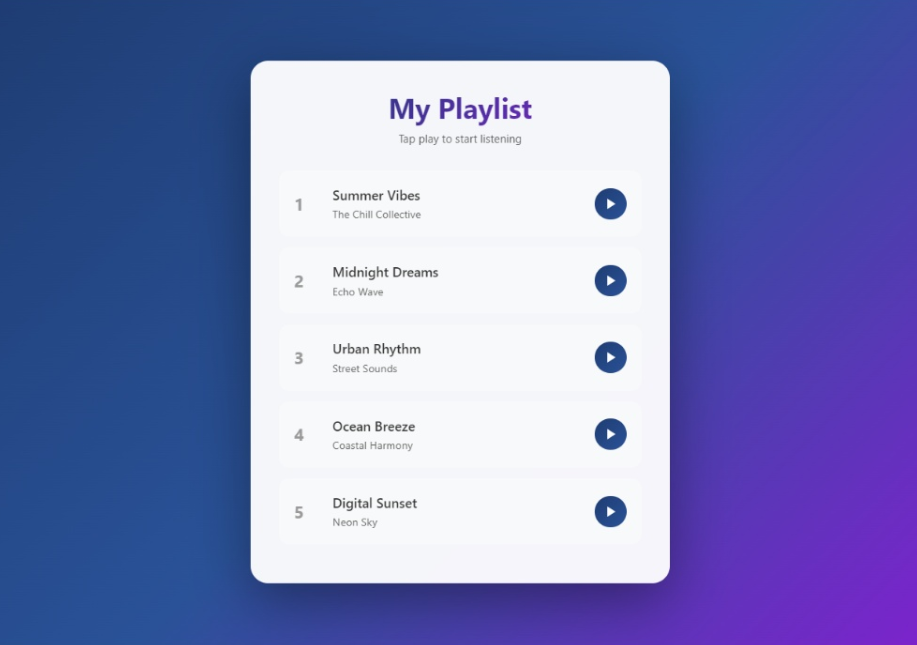
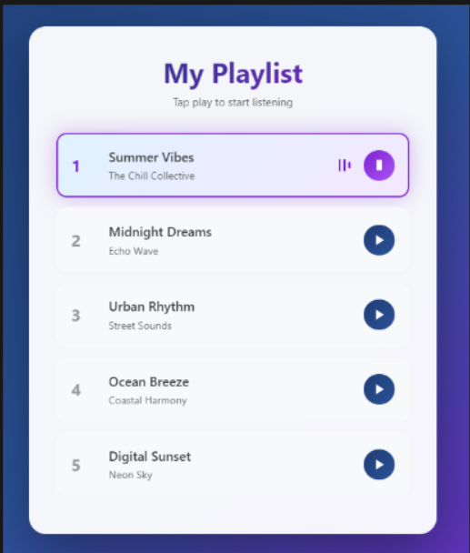

# 🎵 Music Playlist App

A simple and elegant **Music Playlist Web App** that allows you to play and pause songs from your custom playlist.  
Perfect for learning **DOM manipulation, event handling, and GitHub collaboration**.

---

## 🚀 Features

- Play and pause individual songs  
- Highlight the currently playing track  
- Automatically stop the previous song when a new one starts  
- Animated “now playing” indicator  

---

## 🧠 Demo

Here’s how it works:
1. Click the play button beside any song.
2. The song will start playing, and the track will highlight.
3. Clicking “Pause” will stop the song.

---

## 📁 Folder Structure

Music-Playlist/
│
├── index.html
├── style.css
├── script.js
├── README.md
└── CONTRIBUTING.md
---

## 🧰 Tech Stack

- HTML5  
- CSS3  
- JavaScript (Vanilla JS)

---