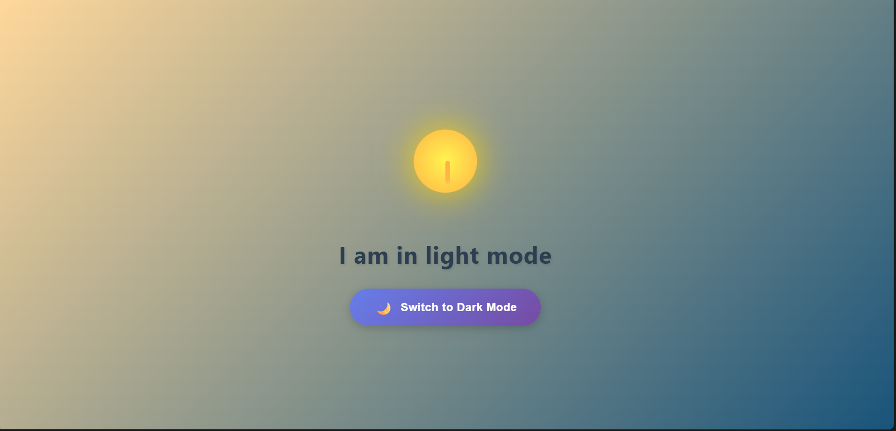
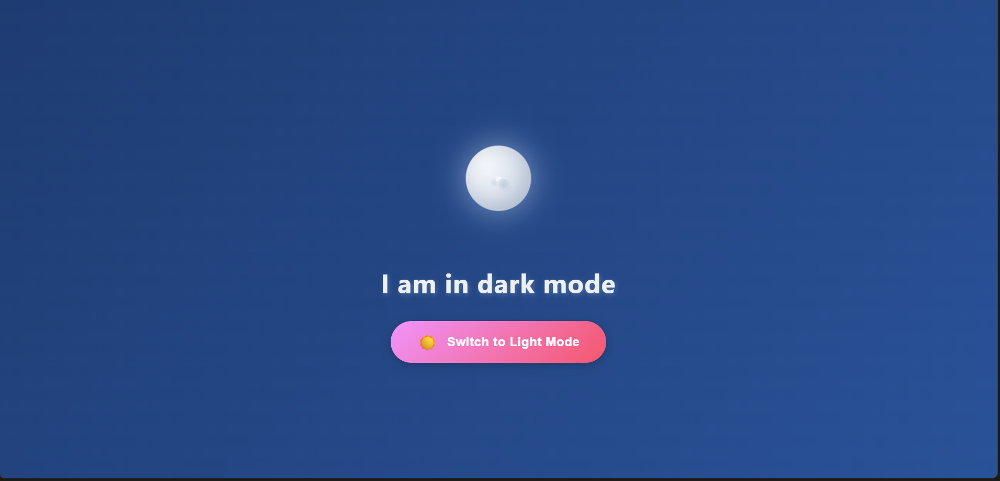

# Theme Changer

A simple and elegant theme toggle application that switches between light and dark modes with animated sun and moon icons.

## Features

- 🌞 Light/Dark theme toggle
- 🎨 Animated sun and moon icons
- 📱 Responsive design
- ⚡ Built with Vite for fast development

## Demo

The application displays:
- Animated sun icon in light mode
- Animated moon icon with stars in dark mode
- Toggle button that switches themes
- Dynamic text that updates based on current theme





## Project Structure

```
project/
├── index.html          # Main HTML file
├── main.js            # JavaScript functionality
├── style.css          # Styling and animations
├── package.json       # Project dependencies
└── public/
    └── vite.svg       # Vite icon
```

## Technologies Used

- HTML5
- CSS3 (with animations)
- Vanilla JavaScript
- Vite (build tool)
## License

