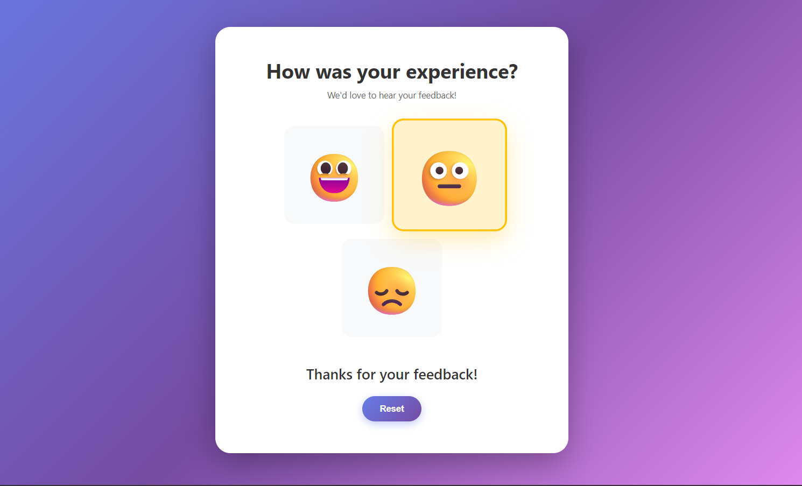
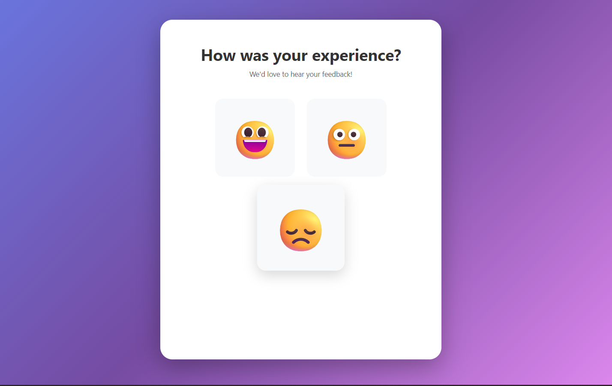

# Feedback Emoji Bar

A simple interactive feedback system using emojis. Users can provide feedback by selecting Happy, Neutral, or Sad emojis, and a message is displayed accordingly. A reset button clears the selection.

## Features

- Interactive emoji-based feedback
- Feedback message updates based on selection
- Reset button clears selection
- Responsive design for mobile and desktop

## Demo

1. Click on any emoji to select it.
2. The message below updates according to the selection.
3. Click "Reset" to clear the selection.

 

## Folder Structure

Feedback-Emoji-Bar/
│
├── index.html
├── style.css
├── main.js
└── README.md

## Technologies Used

- HTML
- CSS
- JavaScript (ES6)